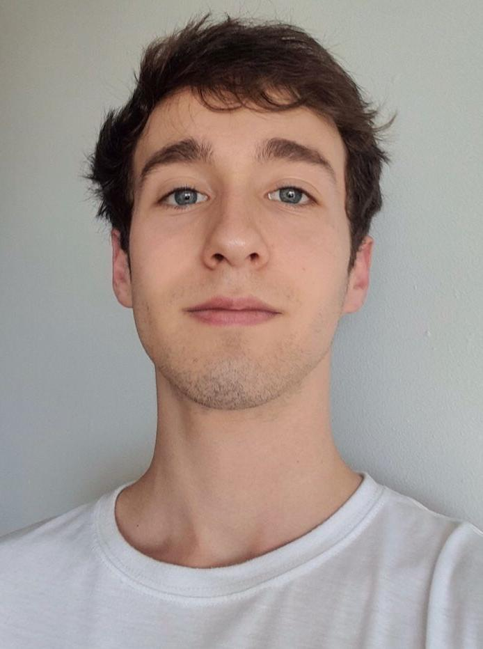
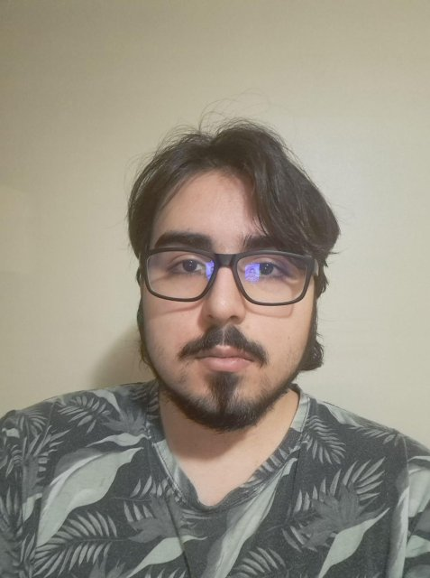

# ☀️ ¿Veranos prolongados en Santiago?

> **Proyecto por parte de estudiantes de Licienciatura en Ciencias de Datos**

## 👤 Integrantes

|📷 **Imagen**                                                                                                              |👥 **Apellidos**                                          | 🗣️ **Nombres**                                          |
|-------------------------------------------------------------------------------------------------------------------------|--------------------------------------------------------|-----------------------------------------------------|
|     | **von Gehr Campos** | **Lucas Andres** |
|  | **Ortúzar Tornero** | **Joaquín Ignacio** |
|  | **Urra Rojas** | **Benjamín Andrés** |

## Contenidos 

* [Acerca del Proyecto](#acerca-del-proyecto)
* [Descubrimientos y hallazgos](#descubrimientos-y-hallazgos)
* [Conclusiones](#conclusiones)

## ✨ Acerca del proyecto

## 👀 Descubrimientos y hallazgos

## ✅ Conclusiones